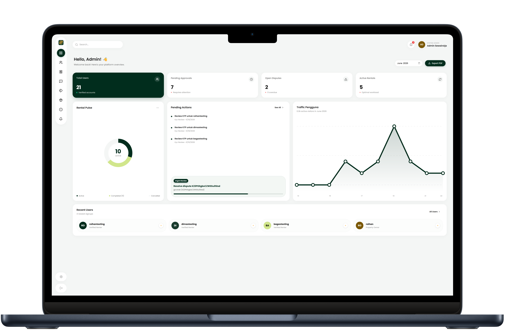

<p align="center">
  
</p>

<h1 align="center">SewainAja — Admin Dashboard & Backend API</h1>

<p align="center">
  
  
  
  
  
  
</p>

<p align="center">
  Panel administrasi dan REST API backend untuk platform peer-to-peer rental barang <b>SewainAja</b>.
</p>

> Proyek PBL Semester 4 — Teknologi Rekayasa Komputer, Politeknik Negeri Semarang

---

## Overview

Repository ini menggabungkan dua komponen:

1. **Admin Dashboard** — Aplikasi web untuk memverifikasi akun pengguna, mengelola kategori barang, dan menengahi sengketa transaksi. Tanpa dashboard ini, tidak ada yang bisa menyetujui akun baru atau menyelesaikan klaim kerusakan.

2. **Backend REST API** — Firebase Cloud Functions berbasis Express yang melayani seluruh request dari mobile app. Semua operasi kritikal (booking, pembayaran, QR handshake, rating) melewati API ini.

Keduanya digabung karena berbagi konfigurasi Firebase yang sama — rules, indexes, dan functions di-deploy dari satu tempat.

---

## Features

### Admin Dashboard

- **Verifikasi KYC** — Review foto KTP + selfie pengguna, approve atau reject
- **Mediasi Sengketa** — Tinjau bukti foto before/after, selesaikan dispute dengan catatan resolusi
- **Kelola Kategori** — CRUD kategori barang beserta ikon visual
- **Monitoring Item** — Pantau listing, blokir barang yang melanggar aturan
- **Dashboard Analytics** — Total users, pending approvals, active rentals, distribusi transaksi
- **Manajemen User** — Daftar user dengan status verifikasi dan statistik
- **Laporan** — Tangani laporan fraud, harassment, dan bad item
- **Export PDF** — Generate laporan dalam format PDF

### Backend API

15 route module yang mencakup:

| Module         | Operasi Utama                                         |
| -------------- | ----------------------------------------------------- |
| Auth           | Register, login, Google OAuth, upload KYC, profile    |
| Addresses      | CRUD alamat tersimpan, set default                    |
| Categories     | List (publik), CRUD (admin)                           |
| Items          | CRUD listing, nearby search, upload foto, follow feed |
| Transactions   | Booking, approve, QR checkin/checkout, perpanjangan   |
| Evidences      | Upload foto before/after                              |
| Chats          | Kirim/baca pesan                                      |
| Payments       | Midtrans integration, webhook, confirm cash           |
| Ratings        | Submit & fetch rating (user + barang)                 |
| Disputes       | Ajukan klaim, detail sengketa                         |
| GPS            | Log koordinat overdue, fetch latest location          |
| Notifications  | List, mark read                                       |
| Admin Users    | List pending, approve/reject KYC                      |
| Admin Disputes | List disputes, review, resolve                        |
| Health         | Health check                                          |

### Scheduled Jobs

| Job                        | Schedule             | Fungsi                                               |
| -------------------------- | -------------------- | ---------------------------------------------------- |
| `checkOverdueTransactions` | Setiap 1 menit       | Deteksi transaksi overdue, kirim reminder bertingkat |
| `generateDailyTrafficLog`  | Setiap hari 00:05    | Hitung statistik harian (users, items, transactions) |
| `resetMonthlyStats`        | Tanggal 1 tiap bulan | Snapshot stats bulan lalu, reset counter bulanan     |

---

## Screenshots

<p align="center">
  
</p>

| Halaman           | Deskripsi                                          |
| ----------------- | -------------------------------------------------- |
| Login             | Autentikasi admin via Firebase Auth                |
| Dashboard         | Statistik platform, charts, pending tasks          |
| User Verification | Review KTP + selfie, approve/reject                |
| Dispute Mediation | Detail sengketa, bukti foto, progress bar, resolve |
| Category Manager  | CRUD kategori dengan upload ikon                   |

---

## Tech Stack

| Layer             | Technology                  |
| ----------------- | --------------------------- |
| Admin Frontend    | Next.js 16, React 19        |
| Styling           | Tailwind CSS v4             |
| Language          | TypeScript                  |
| Backend Runtime   | Node.js 20                  |
| API Framework     | Express                     |
| Deploy Target     | Firebase Cloud Functions v2 |
| Database          | Cloud Firestore             |
| Realtime DB       | Firebase Realtime Database  |
| Auth              | Firebase Auth               |
| File Storage      | Cloudinary                  |
| Push Notification | Firebase Cloud Messaging    |
| Payment Gateway   | Midtrans (Sandbox)          |
| Geospatial        | ngeohash                    |
| PDF Export        | jspdf + html2canvas         |
| Testing           | Vitest + Supertest          |
| Container         | Docker (node:20-alpine)     |

---

## Getting Started

### Prasyarat

- Node.js v20+
- Java JDK v11+ (untuk Firebase Emulator)
- Firebase CLI v13+ (`npm install -g firebase-tools`)

### Instalasi

```bash
git clone https://github.com/sewainaja-pbl/sewainaja-admin.git
cd sewainaja-admin

# Install dependencies frontend + backend
npm install
cd functions && npm install && cd ..

# Login Firebase (sekali saja)
firebase login
```

### Menjalankan Development

```bash
# Build backend
cd functions && npm run build && cd ..

# Jalankan emulator (terminal 1)
firebase emulators:start

# Jalankan frontend (terminal 2)
npm run dev
```

| Service         | URL                   |
| --------------- | --------------------- |
| Admin Dashboard | http://localhost:3000 |
| Emulator UI     | http://127.0.0.1:4444 |
| Functions API   | http://127.0.0.1:5002 |
| Firestore       | http://127.0.0.1:8001 |

### Seed Data (Opsional)

```bash
cd functions
npm run seed          # Seed semua data dummy
# npm run seed:admin  # Atau seed per komponen
```

### Deploy Production

```bash
firebase deploy --only functions    # Cloud Functions
firebase deploy --only firestore    # Rules + indexes
firebase deploy                     # Semua sekaligus
```

---

## Configuration

### `.env.local` (Admin Dashboard)

| Variable                                   | Deskripsi                   |
| ------------------------------------------ | --------------------------- |
| `NEXT_PUBLIC_FIREBASE_API_KEY`             | Web API Key                 |
| `NEXT_PUBLIC_FIREBASE_AUTH_DOMAIN`         | Auth domain                 |
| `NEXT_PUBLIC_FIREBASE_DATABASE_URL`        | Realtime Database URL       |
| `NEXT_PUBLIC_FIREBASE_PROJECT_ID`          | Firebase Project ID         |

| `NEXT_PUBLIC_FIREBASE_MESSAGING_SENDER_ID` | FCM sender ID               |
| `NEXT_PUBLIC_FIREBASE_APP_ID`              | Firebase app ID             |
| `NEXT_PUBLIC_FIREBASE_MEASUREMENT_ID`      | Analytics measurement ID    |
| `NEXT_PUBLIC_API_URL`                      | Cloud Functions URL         |
| `NEXT_PUBLIC_USE_EMULATOR`                 | `true` untuk emulator lokal |

### `functions/.env` (Backend)

| Variable                            | Deskripsi                               |
| ----------------------------------- | --------------------------------------- |
| `FIREBASE_IDENTITY_TOOLKIT_API_KEY` | Web API Key (untuk Identity Toolkit)    |
| `FIREBASE_PROJECT_ID`               | Firebase Project ID                     |
| `SERVICE_ACCOUNT_KEY_PATH`          | (Opsional) Path ke service account JSON |
| `CLOUDINARY_CLOUD_NAME`             | Nama Cloudinary (gratis, 25GB/bulan)    |
| `CLOUDINARY_API_KEY`                | API Key Cloudinary                      |
| `CLOUDINARY_API_SECRET`             | API Secret Cloudinary                   |

Salin dari `.env.example` di masing-masing folder.

---

## Repository Structure

```
sewainaja-admin/
├── app/                      # Next.js App Router
│   ├── login/                # Halaman login admin
│   └── dashboard/            # Dashboard pages (users, disputes, categories, items, transactions, reports, notifications)
├── components/               # Shared UI (AuthGuard, Sidebar, Header, StatCard)
├── lib/                      # Firebase client config & helpers
├── functions/                # Firebase Cloud Functions (Backend)
│   ├── src/
│   │   ├── routes/           # 15 Express router modules
│   │   ├── middleware/       # Auth guards (require-auth, require-admin, require-verified-user)
│   │   ├── triggers/         # Firestore onCreate/onUpdate hooks
│   │   ├── types/            # TypeScript interfaces
│   │   ├── cron.ts           # Scheduled jobs
│   │   └── index.ts          # Entry point
│   └── scripts/              # Seed scripts
├── firestore.rules           # Firestore Security Rules
├── storage.rules             # Storage Security Rules
├── firebase.json             # Firebase config + emulator ports
├── Dockerfile                # Multi-stage Docker build
└── docker-compose.yml
```

Detail teknis (database schema, API spec, transaction workflow) tersedia pada [dokumentasi terpisah](https://github.com/sewainaja-pbl/sewainaja-docs).

---

## Related Repositories

| Repository                                                          | Deskripsi                                                |
| ------------------------------------------------------------------- | -------------------------------------------------------- |
| [sewainaja-mobile](https://github.com/sewainaja-pbl/sewainaja-mobile) | Aplikasi mobile Flutter (iOS & Android)                  |

---

## Team

| Nama                 | NIM          | Role                |
| -------------------- | ------------ | ------------------- |
| **Bagaskara**        | 4.33.24.2.04 | Fullstack Developer |
| **Ghufron Ainun N.** | 4.33.24.2.10 | Fullstack Developer |
| **Roihan Saputra**   | 4.33.24.2.20 | Fullstack Developer |
| **Dimas Adhie N.**   | 4.33.24.2.08 | Fullstack Developer |

**Dosen Pembimbing:** Suko Tyas Pernanda, S.ST., M.Cs & Wiktasari, S.T., M.Kom
**Program Studi:** Teknologi Rekayasa Komputer, Politeknik Negeri Semarang
**Periode:** Semester 4, 2025/2026

---

## License

Proyek akademik — hak cipta dilindungi oleh tim pengembang.
